# Ramaiah Hospital- Hospital Management System

## Overview

**Ramaiah Hospital** is a Java-based Hospital Management System designed to streamline hospital operations. The application provides secure admin login, patient and doctor management, and real-time data handling using MySQL. The intuitive Java Swing interface makes it easy for hospital staff to manage records efficiently.

## Features

- **Admin Login:** Secure authentication for authorized access.
- **Patient Management:** Admit, edit, discharge, and view patient records.
- **Doctor Management:** Add, edit, remove, and view doctor records.
- **Real-Time Data:** All data is stored and updated in a MySQL database.
- **Logout:** Securely log out and return to the login page.

## Technologies Used

Technologies Used
- **Java Swing:** For building the graphical user interface.
- **JDBC (Java Database Connectivity):** For connecting and interacting with the MySQL database.
- **MySQL:** Backend database for storing patient and doctor records.
- **IntelliJ IDEA:** Primary IDE used for development and debugging.
- **Visual Studio Code:** Alternate lightweight IDE for code editing and project management.

## Installation

1. **Clone the Repository:**
   ```bash
   git clone https://github.com/TasteTheThunder/Hospital-Management-System.git
   ```

2. **Setup MySQL Database:**
   - Import the provided SQL schema (`hms.sql`) into MySQL Workbench.
   - Create the required tables: `doctor_record`, `patient_record`, and `users`.
   - Update database connection details in the Java source files (e.g., `LoginPage.java`).

3. **Build and Run the Application:**
   - Open the project in NetBeans, VS Code, or any Java IDE.
   - Build the project to resolve dependencies.
   - Run the `LoginPage` class to start the application.

## Usage

1. **Login:**
   - Enter admin credentials to access the system.
2. **Manage Records:**
   - Use the interface to add, edit, view, or delete patient and doctor records.
   - (If available) Schedule and manage appointments.
3. **Logout:**
   - Click the logout button to securely exit and return to the login page.

## Screenshots

### Login Page
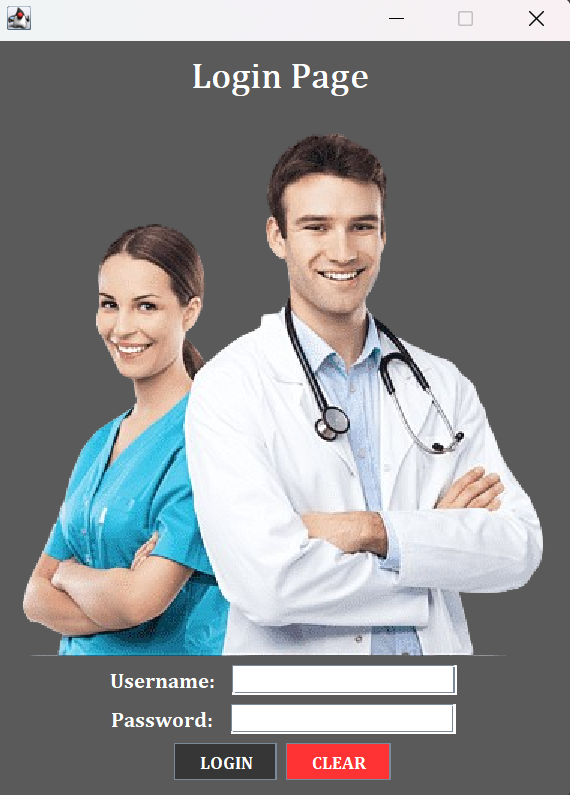

### Welcome Page
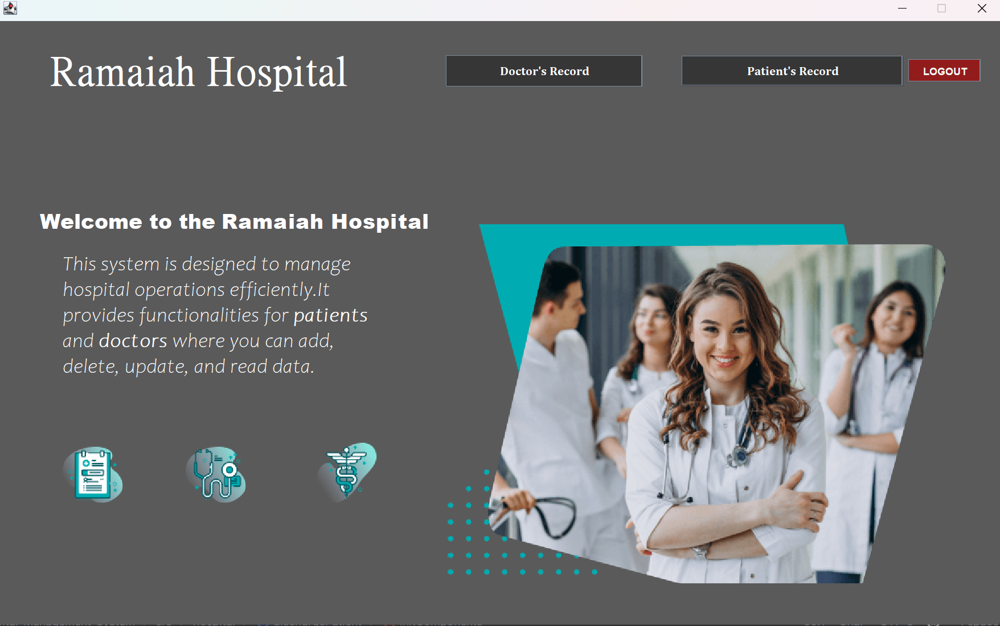

## Patient Management
### Patient Main Page
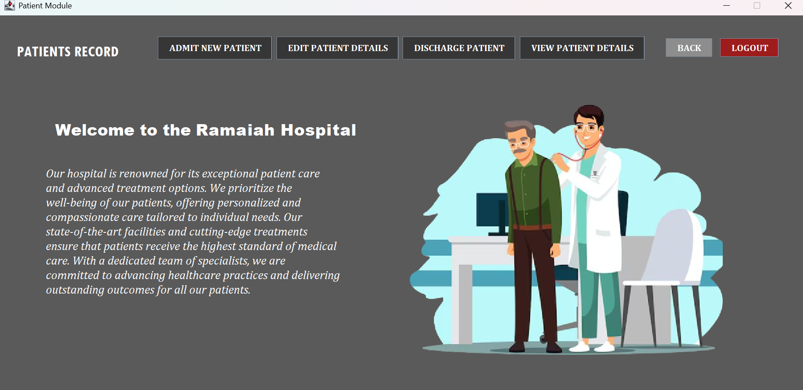

### Admit Patient
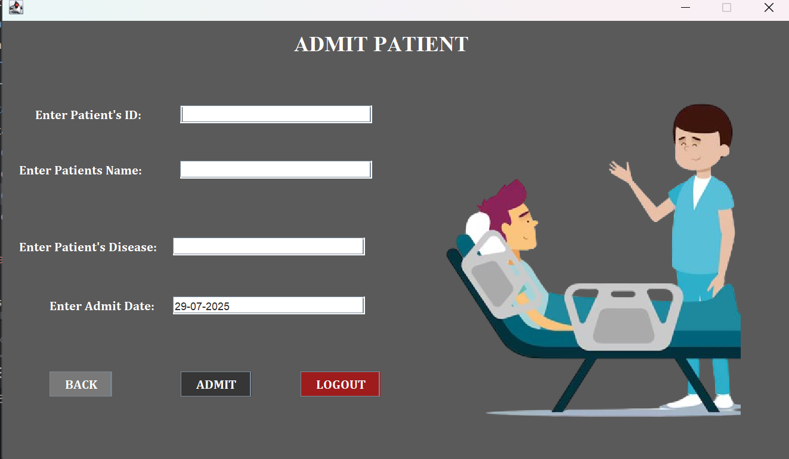

### Edit Patient
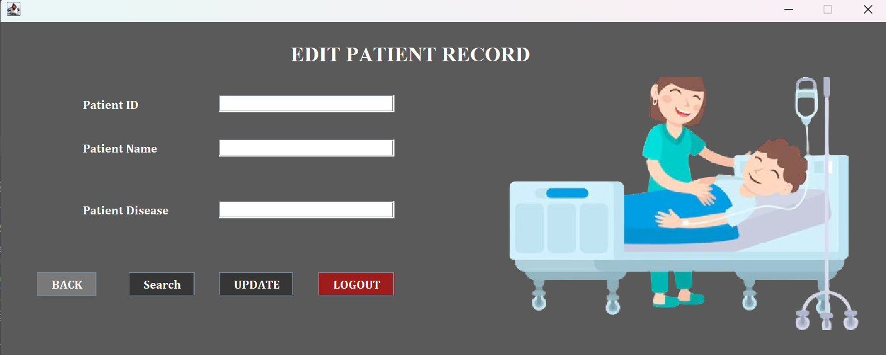

### Discharge Patient
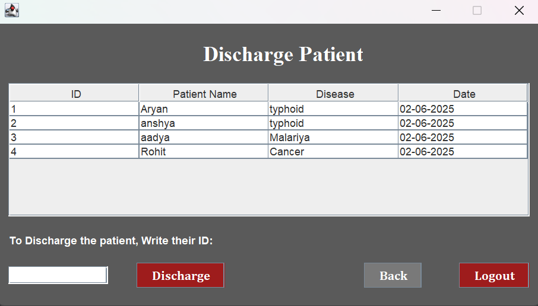

### Patient Record
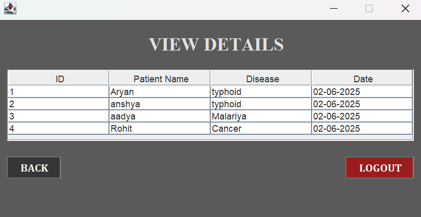

## Doctor Management
### Doctor Main Page
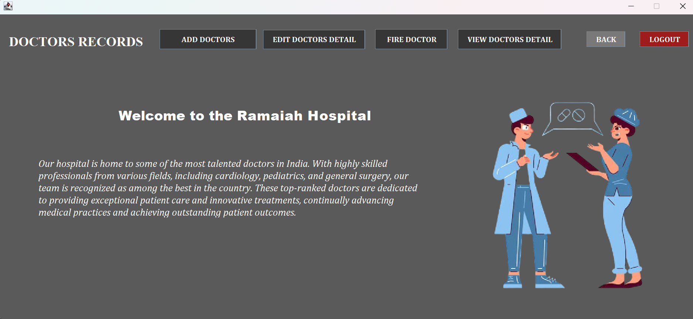

### Add Doctor
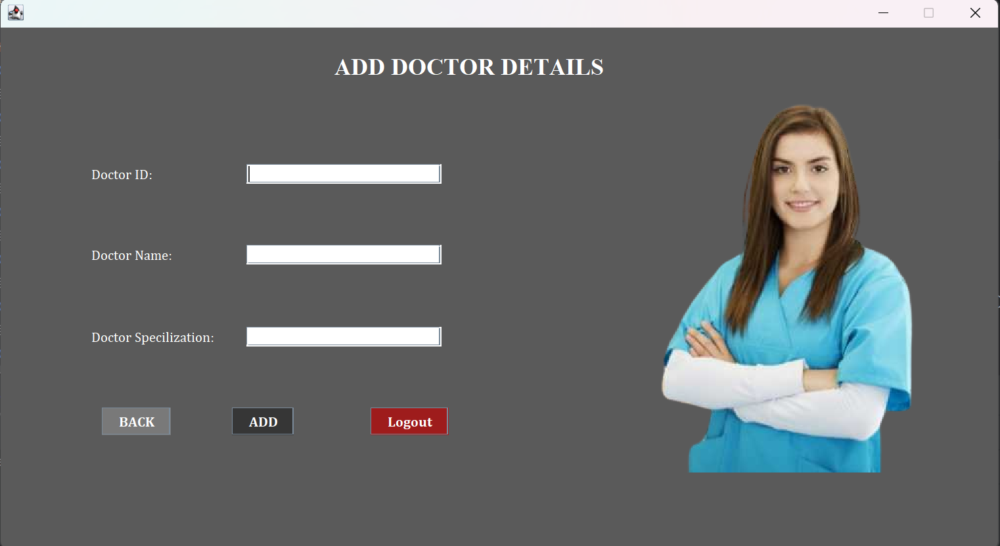

### Edit Doctor
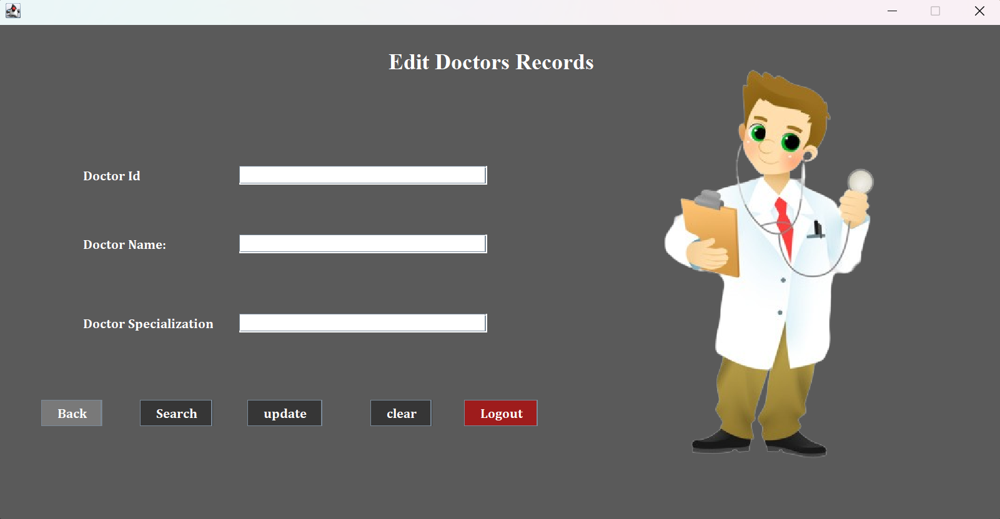

### Fire Doctor
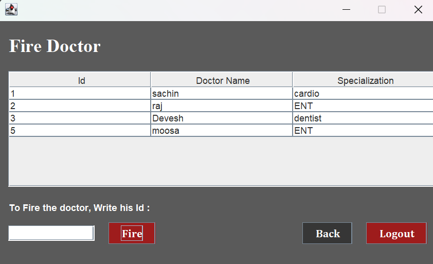

### Doctor Details
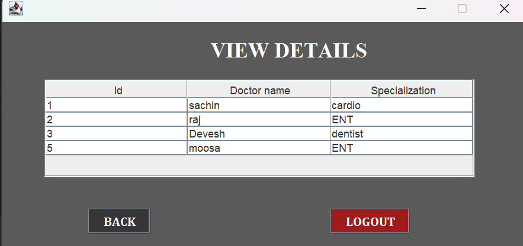
## Folder Structure

```
Hospital-Management-System/
├── src/
│   └── hospital/
│       ├── addDoctor.java
│       ├── PATIENT.java
│       ├── LoginPage.java
│       └── ...other modules
├── Screenshots/
│   ├── login.PNG
│   ├── welcome.PNG
│   ├── patient.PNG
│   └── doctor.PNG
├── README.md
└── Database/
    └──hms.sql

```

## License

This project is licensed under the MIT License – you are free to use, modify, and distribute it with proper attribution.

